# ANALYSE OF AVOCADO MARKET IN UNITED STATES

## Intorduction
It's a training project to learn the whole workflow of the project and practice different type of visualisation that I have studied in online course.

The initial question of the project on Kaggle was: "In which cities can Millenials have their avocado toast AND buy a home?". But to answer the question it's not enough only this dataframe. We need to take into account a lot of other conditions: real estate cost depending on the region, average salary in the domain where this family works, etc. So, it should be a really huge project. Therefore I just focused on basic understanding of avocado market in US.

## Technologies
1. Python
2. Matplotlib
3. Seaborn
4. Pandas
5. Prophet

## Conclusions:
1. First of all I want to mention that it's not very indicative to analyse avocado market in regions as they are not equal: some of them are just one state, like California or New York, other - combination of several, like South-Central. That is why I wouldn't analyse this a lot.

    TOP 10 regions by avocado sold are:

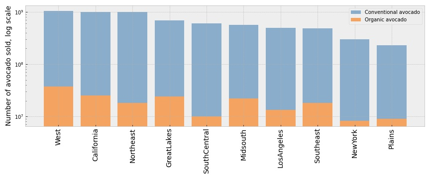

2. From the next chart we can see that average price of avocado depends on the region. The dependance behavior is the same for both types of avocado and the cheapest avocado is in South-Central region (if we take into account only TOP10 regions by sold) and the most expensive is in New York.

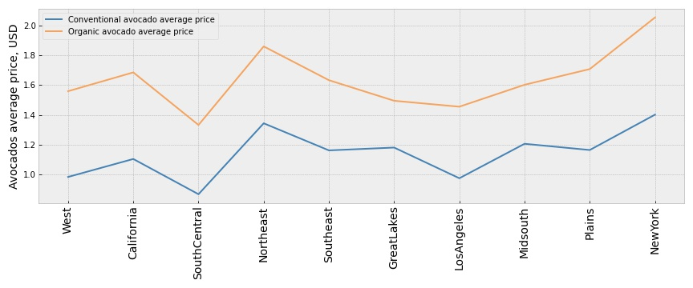

3. It seems like there is a mistake in data as it's not possible that in whole US all organic avocado prices has been dropping down to 1$ (less than price for conventional avocado in this period) and than rised instantly. Therefore I replaced data with mean value of average price of the nearest correct data.

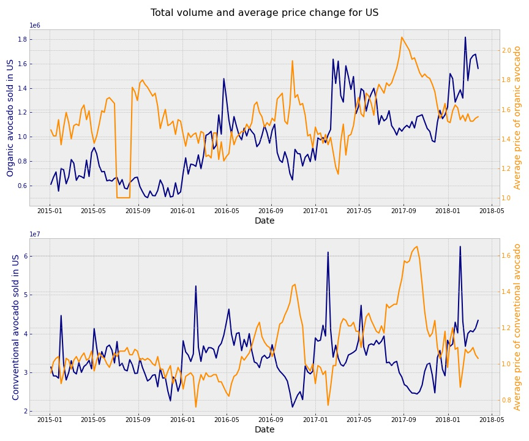

New chart of year 2015 looks like:
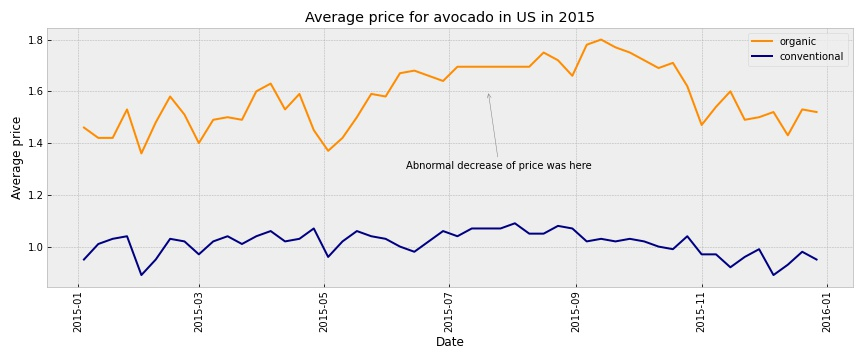

4. There is almost equal quantity of small and large avocado sold.
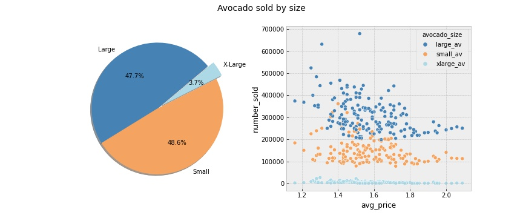

5. More than 98% of sold avocado - conventional type.
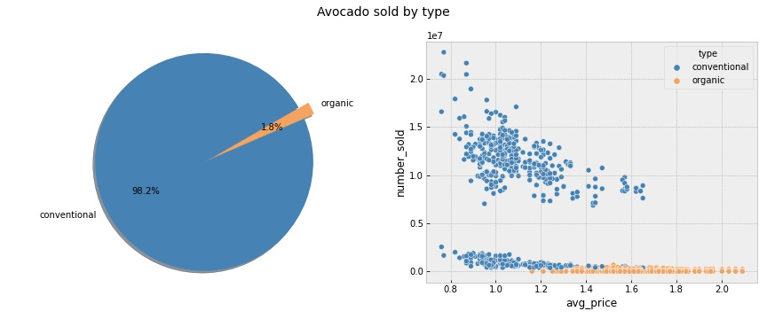

6. We can't see seasonality of avocado consumption, but in 2015-2016 there was the same peak in May.
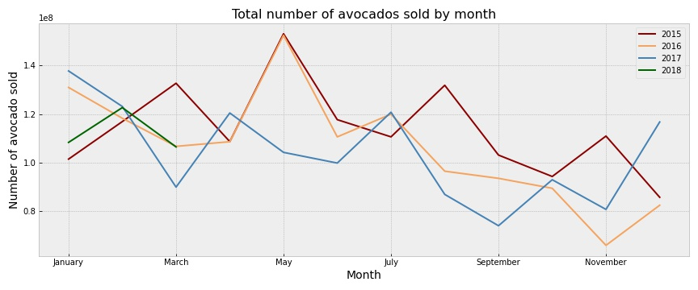

7. Analysing price changing over the years, we can see that there was bigger diversity of price in 2017 comparing to other years.
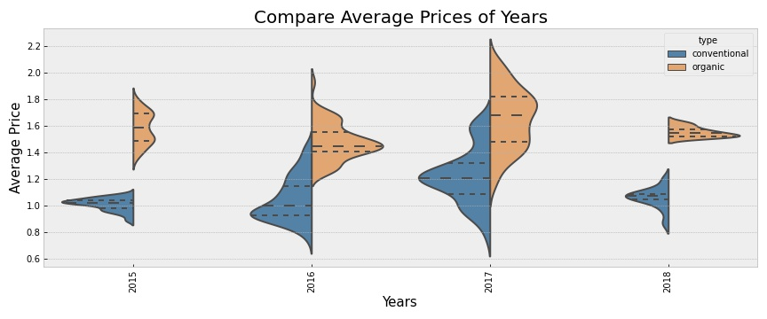

8. Analysing price trend on the months basis, we can observce that in september and october there is a much bigger price variety than in other months:
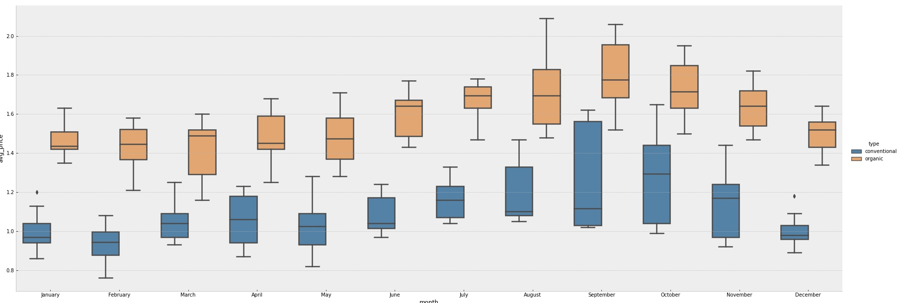

8. We can observe almost normal distribution of average price for both types of avocado.
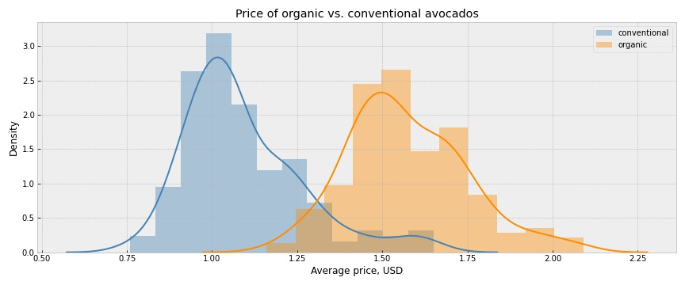

9. On the following chart we see that average price of conventional and organic avocado intersects only at the outliers:

The following statistical values are observed:

| Type        | Minimum| Maximum|Mean  | Median|
| ----------- |:------:| ------:| ----:| -----:|
| conventional| $0.76  |$1.65   |$1.09 |$1.04  |
| organic     | $1.16  |$2.09   |$1.57 |$1.54  |

10. On the following chart we can observe average price forecast for the next year.
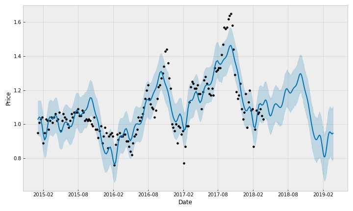

## Examples of use
Marketing projects

## Sources
https://www.kaggle.com/neuromusic/avocado-prices
This data was downloaded from the Hass Avocado Board website in May of 2018 & compiled into a single CSV.